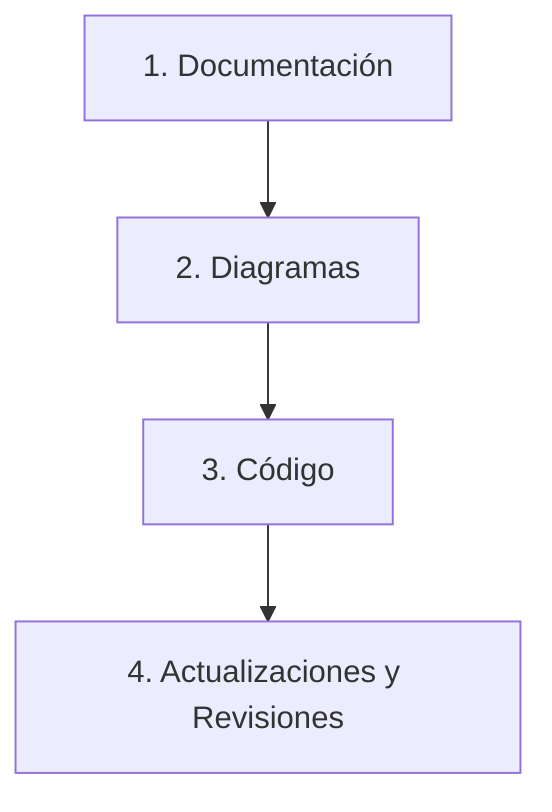

# Ciclo de Desarrollo y Guía Práctica de Git & GitHub

Este documento describe las fases del ciclo de vida del proyecto y proporciona una guía detallada para trabajar de forma colaborativa usando Git y GitHub, diseñada especialmente para integrantes sin experiencia previa.

---

## 1. Ciclo de Desarrollo

Siguiendo el ciclo de desarrollo enseñado en clase, estructuramos nuestro trabajo en las siguientes fases ordenadas:



1. **Documentación (Fase Actual)**: Definición clara de los requerimientos, convenciones, arquitectura lógica, patrones de diseño a aplicar y la estrategia del equipo.
2. **Diagramas**: Creación de diagramas visuales (Diagrama de Clases del sistema y Diagrama de Secuencia de los reportes generados en formato PNG) para validar el diseño lógico antes de escribir código.
3. **Código**: Implementación del modelo de dominio, lectura de datos (CSV/JSON), lógica de análisis, cálculo de impuestos, generación de reportes y creación de pruebas unitarias con xUnit.
4. **Actualizaciones y Revisiones**: Pruebas continuas, refactorizaciones, corrección de bugs, adición de nuevas funcionalidades planificadas (como DTOs y Serialización) y preparación de la sustentación.

---

## 2. Conceptos Básicos de Git y GitHub

Trabajar de forma colaborativa significa que varias personas modifican el mismo código al mismo tiempo. Para evitar que alguien borre el trabajo de otro, usamos **Git** (el programa que controla el historial en tu PC) y **GitHub** (el sitio web donde guardamos el código del grupo).

### Glosario para Principiantes:
*   **Repositorio (Repo)**: La carpeta del proyecto que Git está vigilando. Existe el repositorio *Local* (en tu PC) y el *Remoto* (en la nube de GitHub).
*   **Rama (Branch)**: Es como una línea temporal paralela de tu código. La rama principal se llama `main` (o `master`) y siempre debe tener código limpio que funcione. Para hacer cambios, creamos ramas temporales (ramas de característica o *features*).
*   **Commit**: Es una "foto" o captura guardada de tus cambios en un momento específico. Cada commit tiene un mensaje que explica qué cambiaste.
*   **Push**: Subir tus commits locales desde tu PC a la nube de GitHub.
*   **Pull**: Traer o descargar los últimos cambios de tus compañeros desde GitHub a tu PC.
*   **Pull Request (PR)**: Una solicitud en GitHub para fusionar (unir) los cambios de tu rama temporal a la rama principal (`main`). Permite que tus compañeros revisen tu código antes de unirlo.
*   **Merge**: La acción de fusionar dos ramas.
*   **Conflicto (Merge Conflict)**: Ocurre cuando dos personas modifican la misma línea del mismo archivo a la vez y Git no sabe cuál conservar. Se resuelve manualmente decidiendo qué código se queda.

---

## 3. Flujo de Trabajo Colaborativo (GitHub Flow) Paso a Paso

Para trabajar de forma segura sin romper el código de los demás, seguiremos estos pasos cada vez que vayamos a hacer una tarea:

### Paso 1: Sincronizar tu repositorio local
Antes de empezar a programar, asegúrate de tener la última versión del proyecto.
Abre la terminal en la carpeta del proyecto y ejecuta:
```bash
git checkout main
git pull origin main
```

### Paso 2: Crear una rama de trabajo
**Nunca programes directamente en `main`**. Crea una rama con un nombre descriptivo en minúsculas.
```bash
# Formato: git checkout -b tipo/nombre-de-tarea
git checkout -b feature/lector-csv
```
*   `feature/`: Para nuevas funcionalidades (ej. `feature/lector-csv`, `feature/reporte-xml`).
*   `fix/`: Para corregir errores (ej. `fix/calculo-impuestos`, `fix/error-nulo`).
*   `docs/`: Para documentación (ej. `docs/actualizar-readme`).

### Paso 3: Realizar commits locales mientras programas
A medida que avances en tu tarea, ve guardando tus progresos. No hagas un solo commit gigante al final; haz commits pequeños y descriptivos.
```bash
# 1. Ver qué archivos cambiaste
git status

# 2. Agregar los archivos que quieres guardar
git add NombreDelArchivo.cs
# O agregar todos los archivos modificados: git add .

# 3. Guardar la "foto" con un mensaje descriptivo
git commit -m "feat: implementar la lectura de archivos CSV para clientes"
```

#### Convención de mensajes de Commit (Estilo simplificado):
Utiliza prefijos claros para que el historial sea legible para el profesor:
*   `feat:` cuando agregas nueva funcionalidad (ej. `feat: agregar clase ClienteEmpresarial`).
*   `fix:` cuando corriges un bug (ej. `fix: corregir validación de correo electrónico`).
*   `docs:` cuando cambias documentación (ej. `docs: añadir guía de convenciones`).
*   `refactor:` cuando mejoras el código sin cambiar cómo funciona (ej. `refactor: limpiar bucle en procesador`).

### Paso 4: Subir tu rama a GitHub (Push)
Cuando termines tu tarea y todo funcione en tu PC, sube tu rama a GitHub:
```bash
# La primera vez que subes una rama nueva:
git push -u origin feature/lector-csv

# Las siguientes veces que subas cambios a esa misma rama:
git push
```

### Paso 5: Crear un Pull Request (PR) y fusionar
1.  Entra al repositorio en **GitHub.com**.
2.  Verás un botón amarillo que dice **"Compare & pull request"** de la rama que acabas de subir. Haz clic en él.
3.  Escribe un título y descripción de lo que hiciste.
4.  Asigna a tus compañeros para que revisen los cambios.
5.  Una vez aprobado y verificado que no rompe nada, haz clic en **"Merge pull request"**.
6.  ¡Listo! Tus cambios ya están en la rama `main`. Ahora en tu PC puedes volver a `main` y hacer `git pull` para recibir lo que acabas de fusionar.

---

## 4. Cómo Resolver un Conflicto de Fusión (Merge Conflict)

Si Git te avisa que hay un conflicto al intentar hacer `pull` o fusionar una rama, ¡no entres en pánico! Es normal.
1.  Git marcará el archivo con conflicto mostrando marcas especiales:
    ```csharp
    <<<<<<< HEAD
    // El código que tienes en tu PC actual
    decimal total = subtotal * 1.19m;
    =======
    // El código que está en GitHub que hizo tu compañero
    decimal total = subtotal + (subtotal * 0.19m);
    >>>>>>> branch-compañero
    ```
2.  Abre el archivo en Visual Studio o tu editor de código. El editor te mostrará opciones visuales para "Aceptar cambio actual", "Aceptar cambio entrante" o "Aceptar ambos".
3.  Habla con tu compañero para decidir cuál es el correcto, borra las líneas de marcas (`<<<<<<<`, `=======`, `>>>>>>>`), guarda el archivo y haz un nuevo commit:
    ```bash
    git add ArchivoCorregido.cs
    git commit -m "fix: resolver conflicto en cálculo de total de pedido"
    git push
    ```
