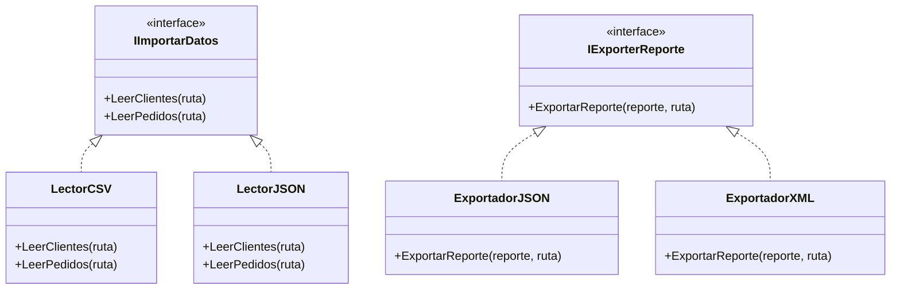
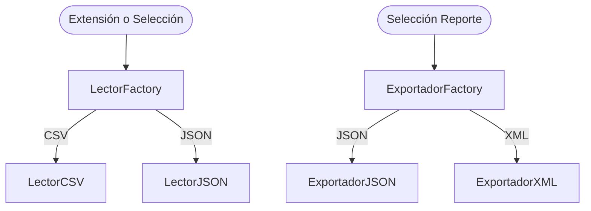

# Diseño de Arquitectura y Patrones de Diseño

Este documento presenta la arquitectura lógica del sistema de análisis de clientes y compras, detallando las responsabilidades de cada clase y la implementación de los patrones de diseño Factory y Strategy.

---

## 1. Declaración de Uso de Inteligencia Artificial

Como equipo, declaramos de forma transparente y honesta que hemos utilizado herramientas de Inteligencia Artificial durante la concepción de este proyecto para los siguientes fines:
*   **Comprensión de conceptos avanzados**: Explicación detallada y comparación práctica de patrones de diseño (Factory y Strategy) y estilo de codificación en C#.
*   **Organización de la información**: Transformación y formateo de nuestras notas iniciales en una estructura de documentación coherente y profesional.

Las **decisiones esenciales de negocio, arquitectura y flujo del software** fueron analizadas y aprobadas por los tres integrantes del equipo para asegurar que el sistema se alinee con las enseñanzas y buenas practicas vistas en clase.

---

## 2. Arquitectura Lógica de Clases y Métodos

Para mejorar la legibilidad y comprensión en comparación con un diagrama UML rígido, a continuación se detallan las clases estructuradas por capas funcionales.

### Capa de Negocio / Dominio

#### A. Cliente (Clase Abstracta)
Representa a un cliente del e-commerce. Contiene la información básica y el método abstracto para clasificar su frecuencia.
*   **Atributos / Propiedades**:
    *   `string Id`: Identificador único (no nulo ni vacío).
    *   `string Nombre`: Nombre del cliente (no nulo ni vacío).
    *   `string Email`: Correo electrónico único y válido (se usa para relacionar con los pedidos).
    *   `string Ciudad`: Ciudad del cliente (puede ser vacía).
    *   `string Tipo`: Tipo de cliente ("natural" o "empresarial").
    *   `decimal TotalAcumulado`: Suma acumulada de todos sus pedidos aprobados.
    *   `Pedido PedidoMasCostoso`: Referencia al pedido de mayor valor asociado a este cliente.
*   **Métodos**:
    *   `public abstract bool EsFrecuente(int compras, decimal total)`: Determina si el cliente califica como frecuente según su tipo.
    *   `public void EnviarEmail()`: Envía correos al cliente.
    *   `public void Guardar()`: Lógica para persistir la información del cliente.

#### B. ClienteNatural (Hereda de `Cliente`)
*   **Métodos**:
    *   `public override bool EsFrecuente(int compras, decimal total)`: Retorna `true` si el cliente tiene **más de 5 compras realizadas**.

#### C. ClienteEmpresarial (Hereda de `Cliente`)
*   **Métodos**:
    *   `public override bool EsFrecuente(int compras, decimal total)`: Retorna `true` si el cliente ha comprado **más de 50 millones de pesos**.

#### D. Pedido (Clase Abstracta)
Representa una compra realizada. Calcula el total sumando sus ítems e impuestos correspondientes.
*   **Atributos / Propiedades**:
    *   `string Id`: Identificador único del pedido (no nulo ni vacío).
    *   `DateTime Fecha`: Fecha de compra.
    *   `string EmailCliente`: Email del cliente asociado (campo de relación).
    *   `string Tipo`: Tipo de pedido ("nacional" o "internacional").
    *   `List<ItemPedido> Items`: Colección de ítems asociados a este pedido.
*   **Métodos**:
    *   `public abstract decimal CalcularTotalPedido()`: Calcula el subtotal acumulado antes de impuestos.
    *   `public abstract decimal CalcularTotalConImpuesto()`: Calcula el precio total final aplicando el impuesto correspondiente.
    *   `public void EnviarEmailCliente()`: Envía confirmación de compra al cliente.
    *   `public void ImprimirFactura()`: Genera salida en formato de factura.

#### E. PedidoNacional (Hereda de `Pedido`)
*   **Atributos / Propiedades**:
    *   `bool Certificado`: Indica si cuenta con certificado de origen nacional.
    *   `string Documento`: Número de documento de tránsito fiscal nacional.
*   **Métodos**:
    *   `public override decimal CalcularTotalPedido()`: Suma el valor de todos los ítems asociados.
    *   `public override decimal CalcularTotalConImpuesto()`: Retorna el subtotal sumando el **19% de impuesto**.

#### F. PedidoInternacional (Hereda de `Pedido`)
*   **Métodos**:
    *   `public override decimal CalcularTotalPedido()`: Suma el valor de todos los ítems asociados.
    *   `public override decimal CalcularTotalConImpuesto()`: Retorna el subtotal sumando el **30% de impuesto**.

#### G. Producto
Representa un artículo en venta del catálogo.
*   **Atributos / Propiedades**:
    *   `string Id`: Identificador único del producto.
    *   `string Nombre`: Nombre del producto.
    *   `string Categoria`: Categoría a la que pertenece.
    *   `decimal PrecioUnitario`: Precio base actual del producto (mayor a cero).
    *   `int NumeroVentas`: Cantidad de unidades vendidas acumuladas en todo el sistema.
*   **Métodos**:
    *   `public void VerificarStock()`: Comprueba la disponibilidad del producto.

#### H. ItemPedido
Representa una línea específica de compra en un pedido (relación muchos a muchos entre `Pedido` y `Producto` con atributos adicionales).
*   **Atributos / Propiedades**:
    *   `string ProductoId`: ID del producto referenciado.
    *   `int Cantidad`: Cantidad comprada (debe ser mayor a cero).
    *   `decimal PrecioUnitario`: Precio al que se vendió el producto (debe ser mayor a cero).

---

### Capa de Servicios y Control

#### I. PipelineProcessor (Controlador Principal)
Orquesta el procesamiento de datos del negocio.
*   **Atributos / Propiedades**:
    *   `private List<Cliente> _clientes`: Lista en memoria de clientes limpios.
    *   `private List<Pedido> _pedidos`: Lista en memoria de pedidos limpios.
    *   `private List<Pedido> _pedidosHuerfanos`: Lista de pedidos cuyos clientes no existen en el archivo de entrada.
    *   `private IImportarDatos _lector`: Estrategia de lectura seleccionada.
    *   `private IExporterReporte _exportador`: Estrategia de exportación seleccionada.
*   **Métodos**:
    *   `public void ExecutePipeline(string rutaClientes, string rutaPedidos, string formatoLectura, string rutaSalida, string formatoEscritura)`: Método que ejecuta secuencialmente la lectura de datos, limpieza, procesamiento de totales y exportación.
    *   `public void ProcesarPedidos()`: Vincula pedidos con clientes, calcula acumulados, actualiza el pedido más costoso por cliente y detecta los huérfanos.
    *   `public void MostrarResumenConsolidado()`: Imprime estadísticas clave en consola al terminar el pipeline.

---

## 3. Patrones de Diseño Aplicados

### A. Patrón Strategy (Estrategia)
Se utiliza para desacoplar la aplicación de los diferentes formatos de archivos físicos que se deben soportar para entrada y salida.

#### 1. Estrategia de Lectura (`IImportarDatos`)
Define el comportamiento común para importar los datos crudos del e-commerce.
*   **Interfaz**: `IImportarDatos`
    *   `List<Cliente> LeerClientes(string ruta)`
    *   `List<Pedido> LeerPedidos(string ruta)`
*   **Estrategias Concretas**:
    *   `LectorCSV`: Implementa la lectura de archivos delimitados por comas.
    *   `LectorJSON`: Implementa la lectura de archivos con sintaxis JSON.

#### 2. Estrategia de Exportación (`IExporterReporte`)
Define el comportamiento para generar el archivo de reporte final analizado.
*   **Interfaz**: `IExporterReporte`
    *   `void ExportarReporte(ReporteData reporte, string ruta)`
*   **Estrategias Concretas**:
    *   `ExportadorJSON`: Genera el archivo final en formato estructurado JSON.
    *   `ExportadorXML`: Genera el archivo final en formato estructurado XML.

---

### B. Patrón Factory (Fábrica)
Se utiliza para encapsular la instanciación de las estrategias. El controlador `PipelineProcessor` no necesita conocer qué clase concreta (`LectorCSV`, `ExportadorXML`, etc.) inicializar, solo interactúa con las interfaces correspondientes.

#### 1. LectorFactory
*   **Método**:
    *   `public static IImportarDatos ObtenerLector(string formato)`
*   **Lógica**: Retorna una instancia de `LectorCSV` si el parámetro es "CSV", o `LectorJSON` si el parámetro es "JSON". Si el formato no es válido, lanza una excepción de argumento.

#### 2. ExportadorFactory
*   **Método**:
    *   `public static IExporterReporte ObtenerExportador(string formato)`
*   **Lógica**: Retorna una instancia de `ExportadorJSON` si el parámetro es "JSON", o `ExportadorXML` si es "XML". Si el formato no es soportado, lanza una excepción.

