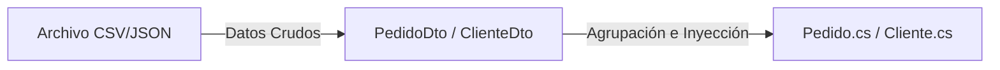

# Requerimientos del Sistema y Planificación de Fases Futuras

Este documento recopila las reglas de negocio críticas extraídas del enunciado del proyecto (PDF) y presenta el diseño propuesto para las fases futuras de desarrollo, centrándose en el manejo de datos externos mediante DTOs (Data Transfer Objects) y Serialización.

---

## 1. Requerimientos de Negocio y Reglas Clave

El sistema consiste en un **Pipeline de Análisis de Clientes y Compras** ejecutado en una aplicación de consola en C#.

### A. Interfaz de Usuario y Flujo de Entrada
El sistema debe solicitar por consola:
1.  La ruta del archivo de clientes.
2.  La ruta del archivo de compras (pedidos).
3.  El formato de lectura de cada archivo (CSV o JSON de forma independiente).

### B. Reglas de Limpieza y Relación de Datos
*   **Autogestión de Entidades**: Cada clase del modelo debe ser responsable de validar y gestionar su propio estado.
*   **Pedidos Huérfanos**: Si un pedido hace referencia a un correo de cliente que no existe en el archivo de clientes, el pedido se considera "huérfano". Debe almacenarse en una lista especial y continuar el procesamiento del resto del archivo sin detenerse.
*   **Datos Sucios o Inconsistentes**: El sistema debe tolerar y limpiar registros nulos, formatos incorrectos de correo o texto, y duplicaciones en las llaves primarias sin detener la ejecución de la aplicación.
*   **Manejo de Errores Propio**: Los únicos errores que detienen la aplicación son fallas catastróficas en la lectura física de archivos (ej. archivo no encontrado, sin permisos). Los errores de negocio o de datos corruptos deben ser controlados.

### C. Clasificación de Cliente Frecuente
*   **Cliente Natural**: Es frecuente si tiene **más de 5 compras** registradas.
*   **Cliente Empresarial**: Es frecuente si el acumulado total de sus compras es **mayor a $50,000,000 COP**.

### D. Aplicación de Impuestos
El precio final del pedido se calcula aplicando un porcentaje según su destino:
*   **Pedido Nacional**: Se le aplica el **19%** de impuesto.
*   **Pedido Internacional**: Se le aplica el **30%** de impuesto.

### E. Estructura Exacta de los Archivos de Entrada

#### Archivo de Clientes:
Columnas o claves esperadas:
*   `id_cliente`: Identificador del cliente.
*   `nombre`: Nombre completo (obligatorio, no vacío).
*   `email`: Dirección de correo electrónico válida (obligatorio, campo de unión).
*   `ciudad`: Ciudad de residencia (puede ser vacía).
*   `tipo_cliente`: Clasificación ("natural" o "empresarial").

#### Archivo de Pedidos (Compras):
Estructura plana donde un pedido con múltiples ítems se repite en varias filas:
*   `id_pedido`: Identificador del pedido.
*   `email_cliente`: Email del cliente asociado.
*   `fecha`: Fecha de compra.
*   `tipo_pedido`: Clasificación ("nacional" o "internacional").
*   `id_producto`: ID del artículo comprado.
*   `nombre_producto`: Nombre del artículo.
*   `categoria_producto`: Categoría del artículo.
*   `cantidad`: Cantidad de unidades (entero mayor a cero).
*   `precio_unitario`: Precio pactado (decimal mayor a cero).

---

## 2. Requerimientos de Salida y Pruebas Unitarias

### A. Reportes Generados
El sistema debe preguntar al usuario el formato de salida (**JSON o XML**) y generar dos archivos físicos:
1.  **Listado de Productos**: Datos de cada producto y la cantidad acumulada de unidades vendidas (`NumeroVentas`).
2.  **Listado de Clientes**: Datos de cada cliente, indicando si es frecuente, el valor total acumulado de sus compras y el detalle de su pedido más costoso (mostrando subtotal, impuesto aplicado y total final).

### B. Resumen en Consola
Al finalizar, se imprime en la consola:
*   Ventas totales consolidadas del negocio.
*   Cantidad total de pedidos nacionales frente a internacionales.
*   Cantidad total de clientes naturales frente a empresariales.

### C. Pruebas Unitarias (con xUnit)
Se exige un mínimo de **5 pruebas unitarias** que garanticen la robustez del sistema en tres escenarios:
1.  **Validación de dato inválido**: Ej. comprobar que un cliente sin email lance una excepción controlada.
2.  **Cálculo de negocio**: Ej. validar que el cálculo de impuesto (19% o 30%) y totales sea correcto.
3.  **Comportamientos intercambiables (Strategy)**: Comprobar que los lectores (CSV y JSON) produzcan la misma lista de objetos a partir de datos equivalentes.

---

## 3. Planes a Futuro: Serialización y DTOs

En la fase de codificación, para implementar la lectura, limpieza y exportación eficientemente, utilizaremos dos patrones de arquitectura de datos: **DTOs** y **Serializadores Nativos**.

### A. Uso de DTOs (Data Transfer Objects)
Dado que los archivos de entrada (especialmente el CSV de pedidos) tienen una estructura plana y repetitiva que no coincide directamente con nuestro modelo orientado a objetos, introduciremos clases DTO.



*   **¿Por qué usar DTOs?**
    *   **Desacoplamiento**: Permite leer los datos con nombres en `snake_case` (como `id_cliente` o `tipo_cliente`) directamente del archivo físico sin ensuciar el modelo de dominio en C# que usa `PascalCase`.
    *   **Agrupación de Ítems**: El archivo de pedidos viene con filas repetidas por cada ítem. Crearemos un `PedidoRegistroDto` para mapear cada fila cruda. Luego, el `PipelineProcessor` agrupará estos DTOs por su `id_pedido` para instanciar un único objeto `Pedido` de dominio que contenga una lista de `ItemPedido`.

#### Ejemplo conceptual del DTO de pedidos:
```csharp
public class PedidoRegistroDto
{
    public string id_pedido { get; set; }
    public string email_cliente { get; set; }
    public string fecha { get; set; }
    public string tipo_pedido { get; set; }
    public string id_producto { get; set; }
    public string nombre_producto { get; set; }
    public string categoria_producto { get; set; }
    public int cantidad { get; set; }
    public decimal precio_unitario { get; set; }
}
```

### B. Implementación de Serialización
*   **Lectura y Escritura de JSON**: Utilizaremos la biblioteca nativa `System.Text.Json` de .NET. Configurando `JsonSerializerOptions` para manejar de manera insensible a mayúsculas y minúsculas y mapear nombres de atributos automáticamente.
*   **Escritura de XML**: Utilizaremos `System.Xml.Serialization.XmlSerializer` para exportar el reporte final con etiquetas limpias que sigan la estructura de `ReporteData`.
